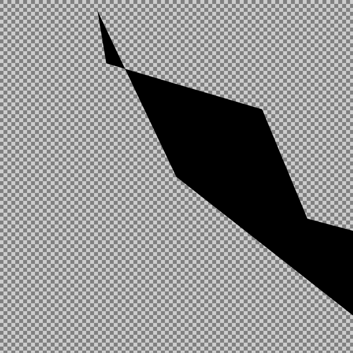
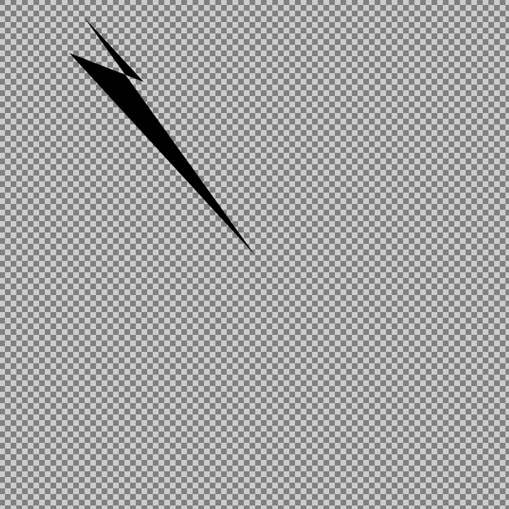
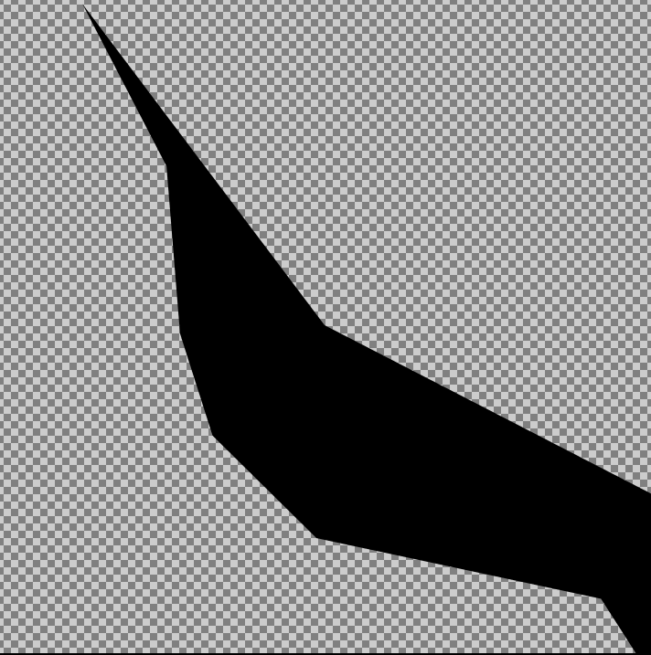
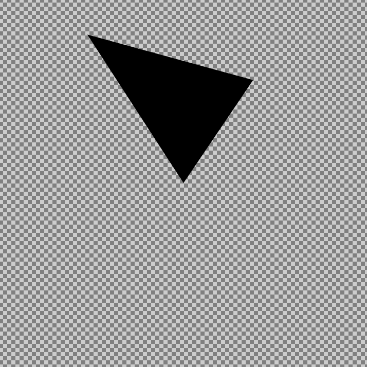
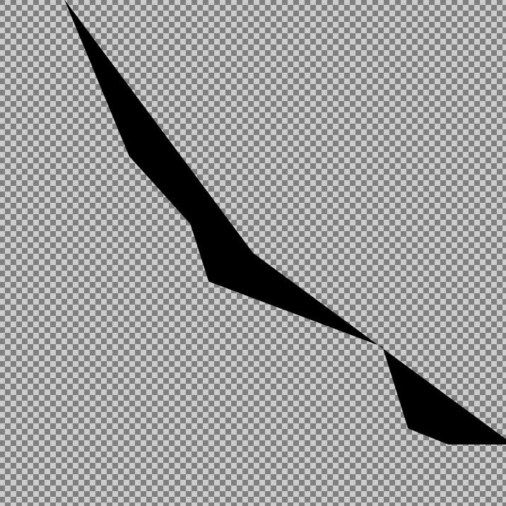
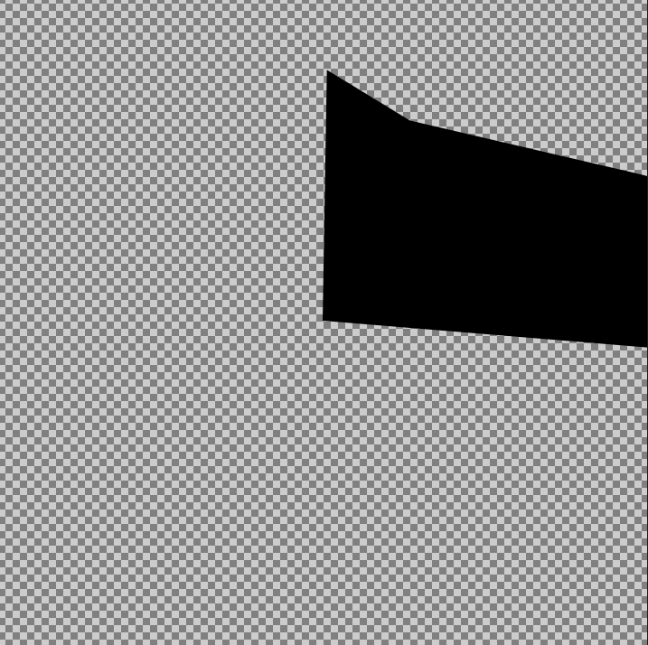
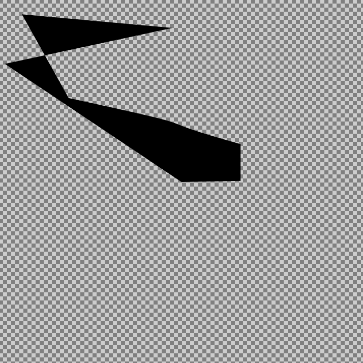

# SDLG (Scalable Deep Learning Graphics)

SDLG is a proof of concept for using an LSTM network to generate text in an SVG style to create vector logos.

120 svg files have been converted to text was utilized as the data source. The svg files that were picked are path-based svg files. Other elements in an svg file that contribute to the formation of a logo include polygons, circles, rectangles, and so on. As a result, I've decided to solely use pathways because the network will be easier to train.

example outcomes:

  
  
  
  